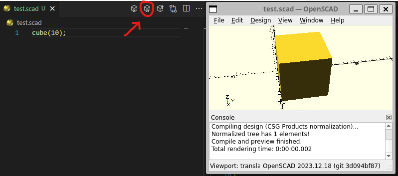

# OpenSCAD

## Installation

Run in a [Dev Containers](vscode:extension/ms-vscode-remote.remote-containers) : a full-fledged environment with OpenSCAD already installed !

After installing the extension in VSCode and cloned the repo, just click on `Reopen in Container` (or `F1`>`Dev Containers: Reopen in Container`) and wait for about 3 minutes (depending on your network connection and hardware). Click on "show logs" to pass the time...


To preview a SCAD object, open a SCAD script and just click on the button, in the right-hand corner: OpenSCAD should be opened automatically:


## Deleting Docker Dev Container

If you want to clean up all the docker images created:
```shell
.devcontainer/clean_docker.sh
```